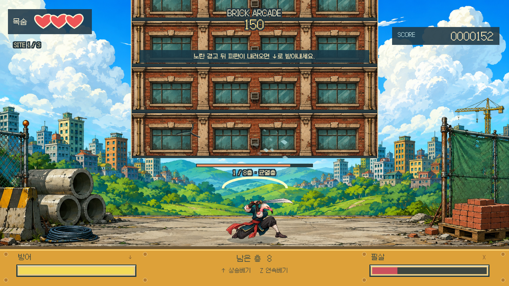
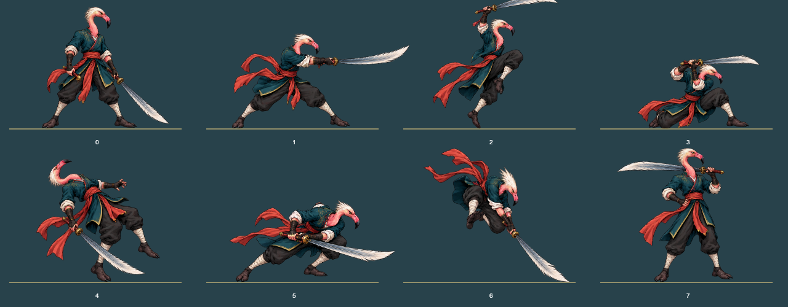

# 플라밍고 건물부수기

**빌딩은 높고, 칼날은 하나.**

층층이 쌓인 건물 아래에서 검을 휘두르고, 떨어지는 파편을 받아친 뒤 충전한 필살기로 여러 층을 가르는 싱글 플레이 액션입니다. 오래된 국내 플래시게임 **건물부수기 Part1**의 화면 구도와 공격·방어 리듬을 참고한 독립 플라밍고 패러디입니다. 원작 SWF·캐릭터·음악을 포함하지 않습니다.

[](docs/browser-qa.md)

위 화면은 실제 키보드 입력으로 실행한 브라우저 캡처입니다. [조작 검수 기록과 한계](docs/browser-qa.md)를 함께 공개합니다.

<table>
<tr>
<td width="50%"><a href="docs/previews/guard.png"></a><br><strong>↓ 받아치기</strong><br>낙하 직전의 짧은 방어가 반격으로 이어집니다.</td>
<td width="50%"><a href="docs/previews/pose-atlas.png"></a><br><strong>8가지 검객 키 포즈</strong><br>대기·베기·상승·방어·피격·충전·필살·승리.</td>
</tr>
<tr>
<td><a href="docs/visual-references.md">원작을 어떻게 관찰하고 바꿨는지 →</a></td>
<td><a href="docs/art-direction.md">새 원화와 생성 프롬프트 보기 →</a></td>
</tr>
<tr>
<td><a href="docs/verification.md">테스트와 브라우저 검증 범위 →</a></td>
<td><a href="public/fonts/OFL.md">Galmuri 폰트 라이선스 →</a></td>
</tr>
</table>

표 안의 방어 자세와 포즈 아틀라스는 이 프로젝트의 실제 Canvas 렌더러로 만든 CPU 캡처입니다. 브라우저 조작 영상이나 자동 완주의 증거로 대신 제시하지 않습니다.

## 로컬 실행

Node.js **22.12 이상**이 필요합니다.

```bash
npm ci
npm run dev
```

로컬 주소: [127.0.0.1:4204 — 작전 시작](http://127.0.0.1:4204/). 포트가 사용 중이면 다른 포트로 이동하지 않고 명시적으로 실패합니다. Sites, 외부 호스팅, 런타임 CDN, 계정 로그인이 필요하지 않습니다.

```bash
npm test          # 판정·입력·수명주기·일반 입력 3단계 완주 검사
npm run build    # 정적 프로덕션 빌드 → dist/
npm run preview  # dev를 종료한 뒤 프로덕션 빌드를 같은 4204에서 확인
npm run capture  # CPU 렌더 캡처 재생성
```

## 조작

| 입력             | 행동               | 알아둘 점                                                                                |
| ---------------- | ------------------ | ---------------------------------------------------------------------------------------- |
| `Z` 짧게 반복    | 연속 베기          | 준비 → 타격 1회 → 회복. 누른 채로 자동 연타되지 않습니다.                                |
| `↑`              | 상승 베기          | 방어 기력 10 소모. 매 3번째 보강층에 더 강합니다.                                        |
| `↓` 누르기       | 방어 / 받아치기    | 낙하물에 닿기 직전 누르면 기력 소모 없이 반격합니다. 짧은 탭에도 0.12초 유예가 있습니다. |
| `X` 누른 뒤 떼기 | 충전 필살          | 게이지 65 이상에서 0.55초 이상 충전. 최대 충전은 여러 층을 관통합니다.                   |
| `Esc`            | 일시정지 / 계속    | 탭 전환과 창 이탈도 일시정지합니다.                                                      |
| `Enter`          | 현장 소개 건너뛰기 | 메뉴는 버튼을 누르거나 Tab/Enter로 선택합니다.                                           |

터치 환경에서는 화면 아래에 네 가지 조작 버튼이 나타납니다. 소리는 기본 OFF이며 새로 합성한 짧은 효과음만 사용합니다. `효과 줄이기`는 화면 흔들림·점멸·충전 회전을 줄이고, OS의 동작 줄이기 설정도 반영합니다.

## 세 현장

| 현장        | 층   | 낙하물            | 공략                                                      |
| ----------- | ---- | ----------------- | --------------------------------------------------------- |
| 오래된 상가 | 8층  | 콘크리트 낙석     | 긴 예고와 ↓ 안내로 공격/방어를 익히는 첫 현장.            |
| 증기 공장   | 9층  | 무거운 철골       | 일반 방어 기력 소모가 커 받아치기나 상승 베어내기를 활용. |
| 유리 관제탑 | 10층 | 시간차 유리 3연타 | 첫 파편만 막고 바로 공격하면 뒤의 파편에 맞습니다.        |

각 현장은 150초 제한입니다. 현장 통과 시 목숨 1개(최대 3)와 방어 기력을 회복합니다. 최종 점수·받아치기·최대 연속 베기·전체 작전 시간을 결과 화면에서 확인할 수 있습니다. 패배하면 처음부터 재도전합니다.

## 구현

독립 Vite + Canvas 2D 프로젝트이며 다른 플라밍고 게임의 공통 엔진이나 UI를 가져오지 않습니다. 고정 60Hz 판정, 렌더 사이에 놓칠 수 있는 키 입력 큐, 8포즈 알파 스프라이트, 실제 층 재질에서 잘라 떨어뜨리는 18개 파편, 타격 위치 기반 균열, 공격 단계와 연동된 검기, 방어 기력/필살 자원을 사용합니다. 메뉴와 HUD 글자는 이미지 속 생성 텍스트가 아닌 HTML/Canvas 텍스트입니다.

[판정 소스](src/game.mjs) · [렌더러](src/paint.mjs) · [입력/메뉴/오디오](src/app.mjs) · [재현 가능한 테스트](tests/game.test.mjs)
