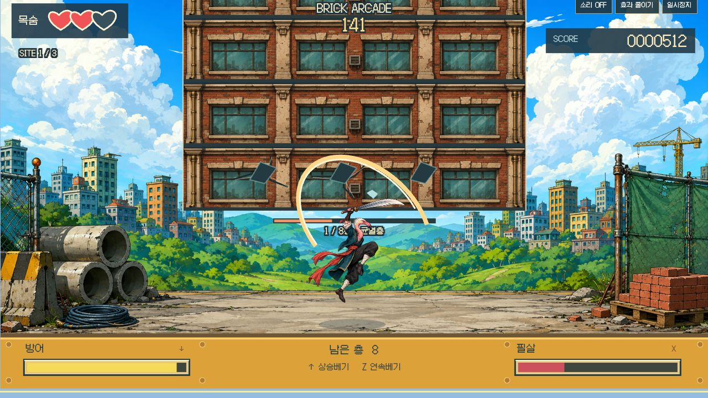

# 실제 브라우저 검수

2026-09-07 · 로컬 4204 · Chromium 기반 브라우저 1280×720. 아래 기록은 실제 버튼·키 입력으로 확인했으며 게임 상태를 직접 주입하지 않았습니다.

- 시작 → 현장 소개 → Enter로 소개 건너뛰기. 건물, 검객, 하단 공격·방어·필살 계기판이 화면 안에 들어옵니다.
- 짧은 Z 입력으로 베기·균열·점수 증가, ↑로 상승 베기·검기·파편과 자원 소모를 확인했습니다.
- 초기 버전은 무입력 패배가 너무 빨랐습니다. 첫 낙하 간격과 예고를 조정한 뒤 다시 확인했습니다. 낙하 전 ↓ 안내가 표시됩니다.
- 낙하 시점에 실제 ↓ 탭을 반복해 받아치기 1회와 750점을 확인했습니다. 이후 실제 피격으로 패배했고 결과에도 받아치기 1회가 표시됐습니다.
- 재시도로 3하트·0점이 복원됩니다. 이후 공격 점수가 152 → 408로 증가하는 것을 확인했습니다.
- Esc로 정지·재개됩니다. 최종 캡처는 새 작전에서 실제 ↑ 공격 후 512점·2하트인 프레임입니다.
- 검수 중 브라우저 경고·오류 로그는 0건이었습니다.

## 자동 검사와 별도인 범위

25개 CPU 테스트와 프로덕션 빌드가 통과했습니다. 일반 입력 정책의 27층 완주는 CPU 판정 검증이지 사람이 브라우저에서 전부 클리어한 기록은 아닙니다. 모바일 터치, 장시간 세션, 모든 보조기술, 모든 기기의 소리와 blur 경로는 별도 실기 검증이 필요합니다. CPU 렌더 이미지는 `previews/`에 구분해서 보관합니다.
